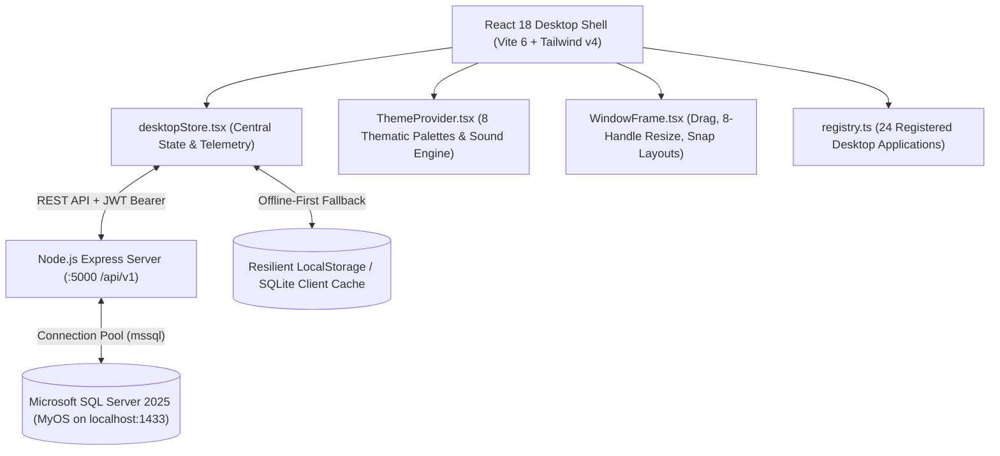

# MyOS — Hybrid Desktop Environment & Productivity Suite

[](docs/CHANGELOG.md)
[](docs/SETUP.md)
[](https://react.dev)
[](https://www.typescriptlang.org)
[](https://tailwindcss.com)
[](https://vitejs.dev)
[](https://www.microsoft.com/sql-server)
[](https://expressjs.com)
[](public/manifest.json)
[](docs/ACCESSIBILITY.md)
[](LICENSE)

A serious, production-grade hybrid desktop environment, productivity suite, and developer workspace designed for modern Windows 10/11 operating systems.

Combining three dominant interface design philosophies into one cohesive, high-performance workspace:
- **Windows 11 (40%)**: Taskbar with hover card window previews, Start Menu, System Tray, Quick Settings action center, Windows 11 hover snap layouts, edge magnet snapping, and Fluent mica/acrylic depth.
- **macOS (30%)**: Dock ergonomic mode, refined typography, spring physics & fluid transitions, workspace-centric app launcher, and glass translucent surfaces.
- **Ubuntu/Linux (30%)**: 4-desktop virtual workspace matrix, universal developer command palette (`Ctrl + Space`), interactive terminal center, system transparency, and live hardware telemetry.

---

## 🚀 One-Click Quick Start & Launcher

Get running in seconds with a single command:

| Platform | Recommended Launcher Command |
| :--- | :--- |
| **Windows (Double-Click)** | Double-click `start-myos.cmd` (or `setup-and-run.bat`) |
| **All Platforms (npm)** | `npm run start:myos` (or `npm run setup`) |
| **Windows (PowerShell)** | `.\start-myos.cmd` or `.\setup-and-run.ps1` |
| **macOS / Linux** | `npm run start:myos` or `./setup-and-run.sh` |
| **Node.js Direct** | `node scripts/start-myos.mjs` |

> [!TIP]
> **Launch-Session Architecture:** Running `npm run start:myos` automatically generates a fresh launch session, verifies prerequisites (Node.js ≥ 20, npm ≥ 10), installs dependencies if missing, starts the server on loopback, and opens MyOS with the cinematic startup animation. Normal browser refreshes (F5 / reload) retain the session and skip the boot animation straight to login/desktop! See [docs/SETUP.md](docs/SETUP.md) and [docs/BOOTSTRAP.md](docs/BOOTSTRAP.md) for full details.

---

## Table of Contents

- [One-Click Quick Start](#-one-click-quick-start)
- [Architectural Overview](#architectural-overview)
- [Key Features & Highlights](#key-features--highlights)
- [Application Catalog (24 Applications)](#application-catalog-24-applications)
- [Microsoft SQL Server Enterprise Data Layer](#microsoft-sql-server-enterprise-data-layer)
- [Design System & Sound Engine](#design-system--sound-engine)
- [Truth in Engineering & Capability Model](#truth-in-engineering--capability-model)
- [Technology Stack](#technology-stack)
- [Project Directory Structure](#project-directory-structure)
- [Getting Started](#getting-started)
- [Essential Keyboard Shortcuts](#essential-keyboard-shortcuts)
- [Architectural Documentation Sitemap](#architectural-documentation-sitemap)
- [License](#license)

---

## Architectural Overview



---

## Key Features & Highlights

### 1. Hybrid Desktop Shell & Window Management
- **Taskbar with Live Hover Previews**: Hover over running applications in the Taskbar to inspect interactive thumbnail preview cards displaying window titles, process status, and real-time bounds.
- **Windows 11 Snap Layouts**: Hover over any window's maximize button to reveal a 4-quadrant snap menu (*Left Half, Right Half, Full Maximize, Quarter Corners*) or drag windows to canvas boundaries for magnetic edge snapping.
- **Virtual Desktops (1–4)**: Switch seamlessly across isolated workspaces with dedicated window stacks and independent 4K wallpapers.
- **Desktop Widgets Layer**: Real-time Weather widget with multi-city cycling, live SVG CPU sparkline telemetry, draggable sticky notes with 5 vibrant colors, and a digital clock.
- **Session Lock Screen**: Security lock screen featuring blurred background wallpaper, digital clock, and PIN keypad authorization (Default: `1234`).
- **Universal Command Palette (`Ctrl + Space`)**: Keyboard-first fuzzy search to launch apps, change themes, toggle sound, or switch workspaces in milliseconds.

### 2. Live Host Telemetry & Native Web APIs
- **Real OS Telemetry**: Replaced all dummy numbers with genuine metrics queried through the Node.js `os` module (Host OS, CPU model & cores, 32 GB RAM, live load sampling, host uptime).
- **Web Battery Status API**: Detects real-time battery charge percentage, charging state, and AC power status via `navigator.getBattery()`.
- **Network Information API**: Real-time online/offline event synchronization and bandwidth status.

---

## Application Catalog (24 Applications)

Every application is built as an interactive, fully functioning vertical slice with custom 3D squircle iconography:

| Application | Icon | Category | Key Capabilities & Features |
| :--- | :---: | :--- | :--- |
| **File Explorer** | 📁 | Core | Virtual folder tree, breadcrumb navigation, search, file/folder creation, delete, and native SQL Server sync. |
| **Settings** | ⚙️ | Core | Theme switcher, effects mode, sound volume, workspace manager, and dedicated **MS SQL Server** management console. |
| **App Catalog** | 📦 | Core | Application store and registry inspector with permission reviews and single-click launch. |
| **Tasks & Sprint Kanban** | 📋 | Productivity | 4-column Sprint Kanban board (*To Do, In Progress, Review, Done*), list view, priority tags (*Urgent, High, Medium, Low*), and project filtering. |
| **Calendar & Events** | 📅 | Productivity | Interactive month calendar grid, daily agenda sidebar, event scheduling, and 1-click meeting join links (Google Meet, Teams, Zoom). |
| **Focus Mode** | 🔥 | Productivity | Pomodoro and Deep Work sessions, circular countdown ring, and procedural Web Audio ambient sound synthesizer (*Rain, Forest, Ocean Waves*). |
| **Notes** | 📝 | Productivity | Markdown note-taking with instant preview, word counter, tags, search, and SQL Server persistence. |
| **Snippet Expander** | ✨ | Productivity | Keyword macro triggers (`!addr`, `!date`, `!react`, `!uuid`), dynamic token substitution (`{date}`, `{time}`, `{uuid}`, `{clipboard}`), and live test sandbox. |
| **Quick Utilities** | 🔧 | Utilities | Color studio with CSS export, UUID v4/NanoID generator, SHA-256/Base64 encoders, and live Regex tester. |
| **Clipboard History** | 📋 | Utilities | Searchable clipboard manager, type filters (Text, Code, URL, Color), sensitive token heuristics, item pinning, and copy-back. |
| **Security Vault** | 🛡️ | System | Master PIN locked credential store (Default: `1234`), 30s live TOTP authenticator ring, and cryptographic password generator. |
| **Antigravity AI** | 🤖 | Productivity | On-device desktop AI assistant for SQL query optimization, React component guidance, and system commands. |
| **Terminal Center** | 💻 | Developer | Interactive shell environment with built-in commands (`help`, `sysinfo`, `ps`, `calc`, `curl`, `workspaces`, `clear`). |
| **Developer Hub** | 🗂️ | Developer | Sprint board, Git status center, project shortcuts, and environment launch profiles. |
| **API Tester** | 🚀 | Developer | Full REST client with HTTP methods (GET, POST, PUT, DELETE), custom headers, JSON body formatting, and latency measurement. |
| **JSON Studio** | 🔍 | Developer | JSON syntax tree viewer, 2/4-space beautifier, minifier, and real-time schema error pinpointing. |
| **Text Editor** | 📄 | Productivity | Lightweight code and text editor with tabs, line numbers, character statistics, and file saving. |
| **Groove Media Player** | 🎵 | Media | Real procedural Web Audio synthesizer (Lo-Fi, Ambient Space, Synthwave 80s) and 32-band FFT canvas spectrum visualizer. |
| **Photo Studio** | 🖼️ | Media | High-resolution photo gallery, image metadata inspector, zoom/pan controls, and 1-click "Set as Desktop Wallpaper". |
| **Task Manager** | 📊 | System | Active process inspector, CPU/Memory telemetry gauges, search, and process termination. |
| **System Information** | 🖥️ | System | Genuine OS version, architecture, CPU model, total/free RAM, and uptime inspection. |
| **Event Viewer & Diagnostics** | ⚡ | System | System health logs, audit records, and JSON diagnostic telemetry export. |
| **Calculator** | 🔢 | Productivity | Standard and scientific calculation engine with live formula strip and history tape. |
| **Clock & Timer** | ⏱️ | Productivity | Multi-timezone world clock (UTC, EST, GMT, PKT, JST), lap stopwatch, and countdown timer. |

---

## Microsoft SQL Server Enterprise Data Layer

The platform is engineered to connect directly to **Microsoft SQL Server (2019/2022/2025)**:

- **Target Database:** `MyOS` on `localhost:1433`
- **Driver:** Node.js `mssql` connection pool with secure parameterization and TLS 1.2+ encryption (`Encrypt=True; TrustServerCertificate=True`).
- **Resilient Fallback:** If SQL Server is offline or undergoing maintenance, the frontend automatically switches to local persistence and continues running seamlessly without crashing.
- **Relational Schema:**
  - `dbo.Workspaces` — Virtual desktop profiles, display order, and wallpapers.
  - `dbo.Applications` — Registered platform applications and capability permissions.
  - `dbo.UserFiles` — Hierarchical virtual file system (directories, files, MIME types).
  - `dbo.Notes` — Markdown notes with timestamps and pin flags.
  - `dbo.WindowStates` — Window positions, dimensions, z-index, and maximized state persistence.
  - `dbo.Notifications` — Action center notifications and read receipts.
  - `dbo.AuditLogs` — Structured security and system events.
  - `dbo.SyncQueue` — Transactional delta queue for offline-to-online sync.

---

## Design System & Sound Engine

### 8 Thematic Color Palettes
Switch themes instantly with real-time CSS variable cascading:
1. **Windows 11 Dark (Default)** — Fluent dark mica surfaces with `#0078d4` accent.
2. **Windows 11 Light** — Clean frosted glass acrylic with high contrast.
3. **Midnight Neon** — Deep OLED black with electric cyan and purple glows.
4. **Graphite Dark** — Minimalist matte zinc designed for distraction-free coding.
5. **Aurora Borealis** — Nordic deep teals and emerald ambient gradients.
6. **Ocean Deep** — Submerged navy blues and marine sapphire tones.
7. **Ubuntu Yaru** — Authentic warm aubergine dark palette with `#e95420` orange.
8. **High Contrast** — WCAG AAA compliant solid contrast with zero blurs.

### 4 Visual Performance Tiers
- **Minimal**: Flat solid backgrounds, zero backdrop blurs, zero animations (ideal for low-end VMs).
- **Balanced (Default)**: Optimized rounded corners, subtle translucent card backgrounds, 150ms transitions.
- **Enhanced**: Deep acrylic blurs, fluid spring physics, and hover glow effects.
- **Immersive**: 40px backdrop blur filters, glowing borders, and particle animations.

### Web Audio Synthesizer (Zero Binary Dependencies)
Procedural audio generated on-the-fly using the browser's native Web Audio API oscillators:
- `click` — Crisp mechanical mouse feedback.
- `open` / `close` — Smooth resonant frequency sweeps.
- `maximize` / `minimize` — Upward and downward pitch bends.
- `snap` — Snappy magnetic confirmation pop.
- `error` — Soft warning double-tone.
- `mute` — Accessible system-wide mute switch with persistent volume control.

---

## Truth in Engineering & Capability Model

In strict adherence to product honesty (see [CAPABILITY_MATRIX.md](docs/CAPABILITY_MATRIX.md)):

| Classification | Meaning | Examples in Suite |
| :--- | :--- | :--- |
| **REAL** | 100% genuine code execution in the client/server runtime. | Notes, Calculator, API Tester, JSON Studio, Kanban, Calendar, Media Player, Vault, SQL Sync. |
| **WINDOWS-INTEGRATED** | Safe integration with host OS via Node standard libraries and WMI. | System Information, genuine CPU/RAM telemetry, Battery Status API, Network info. |
| **APPLICATION-SIMULATED** | Desktop environment behavior sandboxed within the app container. | Virtual desktop canvas, Taskbar, window dragging, snap layouts (does not replace Windows `explorer.exe`). |
| **INFORMATIONAL** | Read-only inspection; does not modify external OS state. | Diagnostic telemetry, event logs, Windows restore information. |
| **UNSUPPORTED** | Explicitly blocked by safety design. | Kernel driver injection, replacing Windows shell (`explorer.exe`), modifying system registries. |

---

## Technology Stack

- **Frontend Core**: [React 18.3](https://react.dev), [TypeScript 5.7](https://www.typescriptlang.org)
- **Build Tool & Bundler**: [Vite 6.1](https://vitejs.dev)
- **Styling Pipeline**: [Tailwind CSS v4](https://tailwindcss.com) via `@tailwindcss/vite` + Vanilla CSS Design Tokens
- **Icons**: [Lucide React](https://lucide.dev)
- **Audio**: Web Audio API Procedural Synthesizer
- **Backend Server**: [Node.js 22](https://nodejs.org), [Express 4.21](https://expressjs.com)
- **Database Engine**: [Microsoft SQL Server](https://www.microsoft.com/sql-server) via official [`mssql`](https://www.npmjs.com/package/mssql) driver
- **Security**: Cryptographic JWT (HMAC SHA-256), client-side AES-256 vault helpers, request tracing via `X-Request-Id`
- **PWA**: Full Web App Manifest (`manifest.json`), service worker ready, complete Apple & SEO icon suite

---

## Project Directory Structure

```text
├── database/
│   └── migrations/
│       ├── 001_initial_schema.sql         # Initial T-SQL schema
│       └── 002_v6_enterprise_schema.sql    # Enterprise relational schema
├── docs/                                  # 23 architectural specifications
│   ├── ARCHITECTURE.md                    # Core system architecture
│   ├── CAPABILITY_MATRIX.md               # Truth-in-engineering capability matrix
│   ├── CHANGELOG.md                       # Release notes and version history
│   ├── DATABASE.md                        # MS SQL Server relational spec
│   ├── SECURITY.md                        # Threat model and security boundaries
│   └── ...                                # Motion, Sound, Themes, API specs
├── native/
│   └── windows/
│       └── querySystem.ps1                # Safe read-only PowerShell inspector
├── public/
│   ├── icons/                             # PWA and favicon icon assets
│   ├── wallpapers/                        # 4K curated desktop wallpapers
│   ├── manifest.json                      # Web App Manifest
│   └── robots.txt                         # Search engine directives
├── server/
│   ├── db.js                              # MS SQL Server pool & auto-seeding
│   └── index.js                           # Express REST API (/api/v1)
├── src/
│   ├── apps/
│   │   ├── components/                    # 24 built-in application components
│   │   │   ├── AiAssistantApp.tsx         # On-device AI assistant
│   │   │   ├── CalendarApp.tsx            # Calendar & meeting joiner
│   │   │   ├── ClipboardManagerApp.tsx    # Clipboard history manager
│   │   │   ├── FocusModeApp.tsx           # Pomodoro & ambient sound synth
│   │   │   ├── MediaPlayerApp.tsx         # Groove synth & FFT visualizer
│   │   │   ├── QuickUtilitiesApp.tsx      # Encoders, UUID, regex playground
│   │   │   ├── SettingsApp.tsx            # Settings & SQL Server manager
│   │   │   ├── TasksApp.tsx               # Sprint Kanban & tasks
│   │   │   ├── VaultApp.tsx               # Security vault & TOTP authenticator
│   │   │   └── ...                        # Explorer, Notes, Terminal, etc.
│   │   └── registry.ts                    # Central 24-app catalog registry
│   ├── core/
│   │   ├── contracts.ts                   # Error codes & 32-permission schema
│   │   ├── desktopStore.tsx               # Global desktop context & telemetry
│   │   ├── i18n.ts                        # en-US and ur-PK dictionaries
│   │   └── types.ts                       # Typed TypeScript interfaces
│   ├── design-system/
│   │   ├── AppIconBadge.tsx               # 3D squircle icons with specular sheen
│   │   ├── soundEngine.ts                 # Web Audio sound synthesizer
│   │   ├── ThemeProvider.tsx              # Theme context & performance tiers
│   │   ├── themes.css                     # 8 complete color themes
│   │   └── tokens.css                     # Centralized design tokens
│   ├── shell/
│   │   ├── CommandPalette.tsx             # Universal search & command palette
│   │   ├── DesktopCanvas.tsx              # Desktop canvas & icon layout
│   │   ├── DesktopWidgets.tsx             # Weather, CPU sparkline, sticky notes
│   │   ├── LockScreen.tsx                 # PIN keypad session lock screen
│   │   ├── NotificationCenter.tsx         # Action center notification tray
│   │   ├── QuickSettings.tsx              # Flyout toggles (Wi-Fi, Volume, Theme)
│   │   ├── StartMenu.tsx                  # Windows 11 Fluent start menu
│   │   └── Taskbar.tsx                    # Hybrid taskbar/dock & window hover cards
│   ├── window-manager/
│   │   └── WindowFrame.tsx                # Window drag, resize, & snap layouts
│   ├── App.tsx                            # Root application component
│   └── index.css                          # Tailwind v4 import & token variables
├── tests/
│   └── contracts.test.mjs                 # Automated unit tests
├── .env                                   # Environment configuration
├── package.json                           # Dependencies and npm scripts
└── vite.config.ts                         # Vite 6 & Tailwind v4 compiler config
```

---

## Getting Started

### Prerequisites

- **Node.js**: v18.0.0 or later (v22 LTS recommended)
- **npm**: v9.0.0 or later
- **Microsoft SQL Server** *(Optional but recommended)*: SQL Server 2019/2022/2025 Express or Developer Edition on `localhost:1433`. *(The application runs in offline-resilient mode automatically if SQL Server is not running).*

### Installation & Setup

1. **Clone the repository:**
   ```bash
   git clone https://github.com/farmanullah1/Windows-Like-Desktop-Environment-Productivity-Suite.git
   cd "Windows-Like-Desktop-Environment-Productivity-Suite"
   ```

2. **Install dependencies:**
   ```bash
   npm install
   ```

### Environment Variables (`.env`)

Create or update [.env](.env) in the root directory:

```env
# Application Environment
NODE_ENV=development
APP_PORT=3000
API_PORT=5000
PORT=5000

# Microsoft SQL Server Configuration
DB_SERVER=localhost
DB_PORT=1433
DB_NAME=MyOS
DB_USER=adw_app_user
DB_PASSWORD=AdwDesktop2026!Secure
DB_ENCRYPT=true
DB_TRUST_SERVER_CERTIFICATE=true
DB_CONNECTION_TIMEOUT_MS=5000

# Security & JWT
JWT_SECRET=your-secure-random-jwt-secret-key
JWT_EXPIRES_IN=7d
SESSION_SECRET=your-secure-session-secret

# Features & Performance
DEFAULT_EFFECTS_MODE=balanced
ENABLE_WEB_AUDIO_SOUNDS=true
LOG_LEVEL=info
ENABLE_AUDIT_LOGGING=true
```

### Running the Application

1. **Start the Express REST API backend:**
   ```bash
   npm run server
   ```
   *The backend starts on port 5000 and automatically verifies tables and seeds initial data in `MyOS`.*

2. **Start the Vite frontend development server:**
   ```bash
   npm run dev
   ```
   *Open your browser and navigate to **`http://localhost:3000`**.*

### Running Tests & Production Build

- **Execute unit test suites:**
  ```bash
  npm test
  ```
  *(Runs 5 comprehensive automated test suites covering permission schemas, IPC channels, i18n dictionaries, error codes, and REST envelopes).*

- **Compile strict TypeScript type check:**
  ```bash
  node ./node_modules/typescript/lib/tsc.js --noEmit
  ```

- **Build optimized production bundle:**
  ```bash
  npm run build
  ```
  *(Compiles production distribution into `dist/` in under 6 seconds).*

---

## Essential Keyboard Shortcuts

| Shortcut | Action | Scope |
| :--- | :--- | :--- |
| <kbd>Ctrl</kbd> + <kbd>Space</kbd> | Open Universal Command Palette | Global |
| <kbd>Win</kbd> / <kbd>Super</kbd> | Toggle Start Menu | Global |
| <kbd>Win</kbd> + <kbd>D</kbd> | Minimize All / Show Desktop | Global |
| <kbd>Ctrl</kbd> + <kbd>Alt</kbd> + <kbd>→</kbd> | Switch to Next Virtual Workspace | Global |
| <kbd>Ctrl</kbd> + <kbd>Alt</kbd> + <kbd>←</kbd> | Switch to Previous Virtual Workspace | Global |
| <kbd>Escape</kbd> | Dismiss Menus, Flyouts & Modals | Global |
| <kbd>Tab</kbd> / <kbd>Shift+Tab</kbd> | Navigate Focusable Elements | Accessible UI |

---

## Architectural Documentation Sitemap

Explore detailed technical specifications located in the [docs/](docs/) directory:

- [System Architecture](docs/ARCHITECTURE.md) — Comprehensive technical overview.
- [Capability Matrix](docs/CAPABILITY_MATRIX.md) — Truth-in-engineering classification.
- [Security Model & Threat Assessment](docs/SECURITY.md) — Authentication, permissions, and threat vectors.
- [Database Specification](docs/DATABASE.md) — MS SQL Server schema, indexing, and sync queues.
- [REST API Specification (`/api/v1`)](docs/API.md) — Endpoints, request schemas, and response envelopes.
- [Themes & Design Tokens](docs/THEMES.md) — Token hierarchy, CSS variables, and color recipes.
- [Motion & Animation System](docs/MOTION.md) — Spring physics, performance tiers, and reduced motion.
- [Web Audio Sound Engine](docs/SOUND.md) — Procedural synthesis and audio frequency curves.
- [Accessibility Guide](docs/ACCESSIBILITY.md) — WCAG 2.1 AA keyboard navigation, contrast, and ARIA roles.
- [Windows Integration & Native Bridge](docs/WINDOWS-INTEGRATION.md) — WMI, PowerShell bridge, and process controls.
- [Testing & Quality Assurance](docs/TESTING.md) — Test matrix, unit testing, and E2E verification.
- [Changelog](docs/CHANGELOG.md) — Detailed version-by-version release history.

---

## License

This project is licensed under the **MIT License** — see the [LICENSE](LICENSE) file for details. Built with passion for modern desktop ergonomics, beautiful interface design, and resilient engineering.
