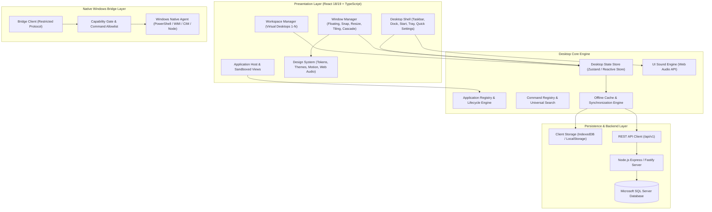

# System Architecture Specification

## 1. Overview
The **Windows-Like Desktop Environment & Productivity Suite (Version 5.0)** is an enterprise-grade desktop productivity workstation application. It provides a complete virtual desktop operating experience inside a Windows environment, fusing the aesthetic and organizational principles of:
- **Windows 11 (40%)**: Taskbar, Start menu, system tray, quick settings, action center, Fluent acrylic/mica depth, window snap grids, and native OS bridge.
- **macOS (30%)**: Dock mode, refined typography, springs, workspace navigation, application launcher, subtle glass translucency.
- **Ubuntu/Linux (30%)**: Virtual workspace matrix, application overview switcher, developer command palette, terminal center, system transparency.

---

## 2. Layered Architecture Diagram



---

## 3. Core Subsystems

### 3.1 Desktop Shell
- **Modes**: Configurable via Settings:
  - *Windows Mode*: Centered or left-aligned taskbar, Start button, pinned apps, running instances, system tray, clock.
  - *macOS Mode*: Floating bottom dock with magnification, active dots, top system bar.
  - *Hybrid Mode (Default)*: Floating island taskbar combining dock fluidity with Windows 11 system tray and start launcher.
  - *Developer Mode*: Minimalist status bar with active workspace indicators, git/system telemetry, and quick terminal trigger.
- **Start Menu**: Categorized application grid, pinned favorites, recently accessed files, search input, power options (Lock, Switch User, Restart, Shutdown with explicit native confirmation).
- **Universal Search & Command Palette**: Fuzzy search over applications, open windows, files, notes, settings, and commands (`Ctrl+Space` or `Alt+K`).
- **Notification Center & Quick Settings**: Slide-out panels for system toggles (Wi-Fi, Bluetooth, Audio, Theme, Performance Mode, Volume) and grouped notifications.

### 3.2 Window Manager Engine
- **Window Model**:
  ```typescript
  export interface WindowState {
    id: string;
    appId: string;
    title: string;
    icon: string;
    x: number;
    y: number;
    width: number;
    height: number;
    minWidth: number;
    minHeight: number;
    zIndex: number;
    workspaceId: string;
    isFocused: boolean;
    isMinimized: boolean;
    isMaximized: boolean;
    isFullscreen: boolean;
    isResizable: boolean;
    isDraggable: boolean;
    isModal: boolean;
    snapState: 'none' | 'left' | 'right' | 'top' | 'top-left' | 'top-right' | 'bottom-left' | 'bottom-right';
  }
  ```
- **Z-Index Stacking**: Dynamic focus elevation, modal layering, and cascade positioning for newly launched windows.
- **Snap & Tiling Engine**: Edge drag-detection with visual snap preview bounds (50% left/right, 100% top, 25% quadrant corners).

### 3.3 Virtual Workspaces Manager
- **Isolation**: Each workspace maintains its own active window collection and custom wallpaper/theme configuration.
- **Switching**: Smooth slide/fade transitions; keyboard shortcuts (`Ctrl+Alt+Left/Right` or `Win+Ctrl+Arrow`).
- **Window Migration**: Dragging windows between workspaces via the Overview Switcher (`Super` / `Win+Tab` equivalent).

### 3.4 Application Registry & Sandbox
- Every application registers metadata: ID, title, icon, category, entrypoint component, permission requirements (`system.read`, `filesystem.read`, `filesystem.write`), and default window dimensions.
- Managed lifecycle transitions: `REGISTERED` -> `LAUNCHING` -> `RUNNING` -> `MINIMIZED` -> `CLOSING` -> `CLOSED`.

### 3.5 Native Windows Integration Bridge
- A strictly bounded, permission-gated bridge interface.
- Safe read-only inspection of Windows OS version, CPU, RAM, disk utilization, battery status, and running processes.
- Execution of commands is strictly restricted through an allowlist to prevent arbitrary code execution or command injection.

---

## 4. Technology Decisions Rationale

1. **Vite + React + TypeScript**:
   - Ultra-fast build times, strictly typed domain models, and seamless integration with modern web and desktop WebView runtimes.
2. **Vanilla CSS Design System with CSS Tokens**:
   - Eliminates CSS utility bloating, prevents selector leakage, guarantees high-framerate hardware acceleration (`transform`, `opacity`), and easily supports multi-tier theming.
3. **Web Audio API Synth Audio Engine**:
   - Generates non-intrusive, procedural feedback sounds immediately without requiring heavy remote audio asset downloads, while allowing audio asset expansion.
4. **Microsoft SQL Server for Relational Persistence**:
   - Enterprise-grade ACID transactions, strict relational constraints, audit logging, and battle-tested reliability for productivity data.
