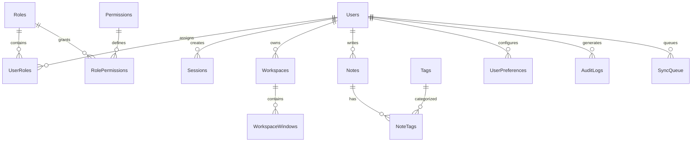

# Database Architecture & Schema Specification

## 1. Engine & Specifications
- **Database Engine:** Microsoft SQL Server (2019 / 2022 / Express / Azure SQL)
- **Collation:** `Latin1_General_100_BIN2` or `SQL_Latin1_General_CP1_CI_AS`
- **Isolation Level:** `READ COMMITTED SNAPSHOT` (RCSI) for high-concurrency read operations without read locks
- **Migration Strategy:** Versioned, sequential T-SQL scripts (`001_initial_schema.sql`, etc.) tracked in a `_SchemaMigrations` table with explicit rollback scripts.
- **Safety Rule:** Migrations are created in code but **never automatically executed** without explicit user consent.

---

## 2. Entity Relationship Overview

---

## 3. Core Tables Specification

### 3.1 Users & Authentication
- **`Users`**:
  - `Id` (NVARCHAR(36), PK, GUID/UUID)
  - `Username` (NVARCHAR(50), UNIQUE, NOT NULL)
  - `Email` (NVARCHAR(255), UNIQUE, NOT NULL)
  - `PasswordHash` (NVARCHAR(255), NOT NULL)
  - `FullName` (NVARCHAR(100), NULL)
  - `AvatarUrl` (NVARCHAR(500), NULL)
  - `IsActive` (BIT, DEFAULT 1, NOT NULL)
  - `CreatedAt` (DATETIMEOFFSET, DEFAULT SYSDATETIMEOFFSET(), NOT NULL)
  - `UpdatedAt` (DATETIMEOFFSET, DEFAULT SYSDATETIMEOFFSET(), NOT NULL)

- **`Sessions`**:
  - `Id` (NVARCHAR(36), PK)
  - `UserId` (NVARCHAR(36), FK -> Users.Id, NOT NULL)
  - `RefreshTokenHash` (NVARCHAR(255), NOT NULL)
  - `UserAgent` (NVARCHAR(500), NULL)
  - `IpAddress` (NVARCHAR(45), NULL)
  - `ExpiresAt` (DATETIMEOFFSET, NOT NULL)
  - `IsRevoked` (BIT, DEFAULT 0, NOT NULL)
  - `CreatedAt` (DATETIMEOFFSET, DEFAULT SYSDATETIMEOFFSET(), NOT NULL)

### 3.2 Roles & Permissions (RBAC)
- **`Roles`**: `Id`, `Name` ('Administrator', 'PowerUser', 'StandardUser', 'Guest'), `Description`
- **`Permissions`**: `Id`, `Scope` ('system.read', 'filesystem.read', 'filesystem.write', 'process.read', 'settings.manage', 'workspace.manage')
- **`RolePermissions`**: `RoleId`, `PermissionId` (Composite PK)
- **`UserRoles`**: `UserId`, `RoleId` (Composite PK)

### 3.3 Workspaces & Windows
- **`Workspaces`**:
  - `Id` (NVARCHAR(36), PK)
  - `UserId` (NVARCHAR(36), FK -> Users.Id, NOT NULL)
  - `Name` (NVARCHAR(100), NOT NULL)
  - `SortOrder` (INT, NOT NULL)
  - `WallpaperUrl` (NVARCHAR(500), NULL)
  - `ThemeOverride` (NVARCHAR(50), NULL)
  - `IsActive` (BIT, DEFAULT 0, NOT NULL)
  - `CreatedAt`, `UpdatedAt`

- **`WorkspaceWindows`**:
  - `Id` (NVARCHAR(36), PK)
  - `WorkspaceId` (NVARCHAR(36), FK -> Workspaces.Id, NOT NULL)
  - `AppId` (NVARCHAR(50), NOT NULL)
  - `Title` (NVARCHAR(255), NOT NULL)
  - `PosX` (INT, NOT NULL)
  - `PosY` (INT, NOT NULL)
  - `Width` (INT, NOT NULL)
  - `Height` (INT, NOT NULL)
  - `ZIndex` (INT, NOT NULL)
  - `IsMinimized` (BIT, DEFAULT 0, NOT NULL)
  - `IsMaximized` (BIT, DEFAULT 0, NOT NULL)
  - `SnapState` (NVARCHAR(20), DEFAULT 'none', NOT NULL)

### 3.4 Notes & Productivity Storage
- **`Notes`**:
  - `Id` (NVARCHAR(36), PK)
  - `UserId` (NVARCHAR(36), FK -> Users.Id, NOT NULL)
  - `Title` (NVARCHAR(255), NOT NULL)
  - `Content` (NVARCHAR(MAX), NOT NULL)
  - `IsPinned` (BIT, DEFAULT 0, NOT NULL)
  - `IsArchived` (BIT, DEFAULT 0, NOT NULL)
  - `ColorHex` (NVARCHAR(10), NULL)
  - `Version` (BIGINT, DEFAULT 1, NOT NULL)
  - `CreatedAt`, `UpdatedAt`

### 3.5 System Audit & Synchronization
- **`AuditLogs`**:
  - `Id` (BIGINT, IDENTITY(1,1), PK)
  - `UserId` (NVARCHAR(36), NULL)
  - `EventType` (NVARCHAR(50), NOT NULL)
  - `Resource` (NVARCHAR(100), NOT NULL)
  - `Action` (NVARCHAR(50), NOT NULL)
  - `Outcome` (NVARCHAR(20), NOT NULL)
  - `DetailsJson` (NVARCHAR(MAX), NULL)
  - `IpAddress` (NVARCHAR(45), NULL)
  - `CreatedAt` (DATETIMEOFFSET, DEFAULT SYSDATETIMEOFFSET(), NOT NULL)

- **`SyncQueue`**:
  - `Id` (NVARCHAR(36), PK)
  - `UserId` (NVARCHAR(36), NOT NULL)
  - `EntityName` (NVARCHAR(50), NOT NULL)
  - `EntityId` (NVARCHAR(36), NOT NULL)
  - `Operation` (NVARCHAR(10), NOT NULL) -- INSERT, UPDATE, DELETE
  - `PayloadJson` (NVARCHAR(MAX), NOT NULL)
  - `ClientTimestamp` (DATETIMEOFFSET, NOT NULL)
  - `Status` (NVARCHAR(20), DEFAULT 'Pending', NOT NULL)
  - `Attempts` (INT, DEFAULT 0, NOT NULL)
  - `LastError` (NVARCHAR(MAX), NULL)
